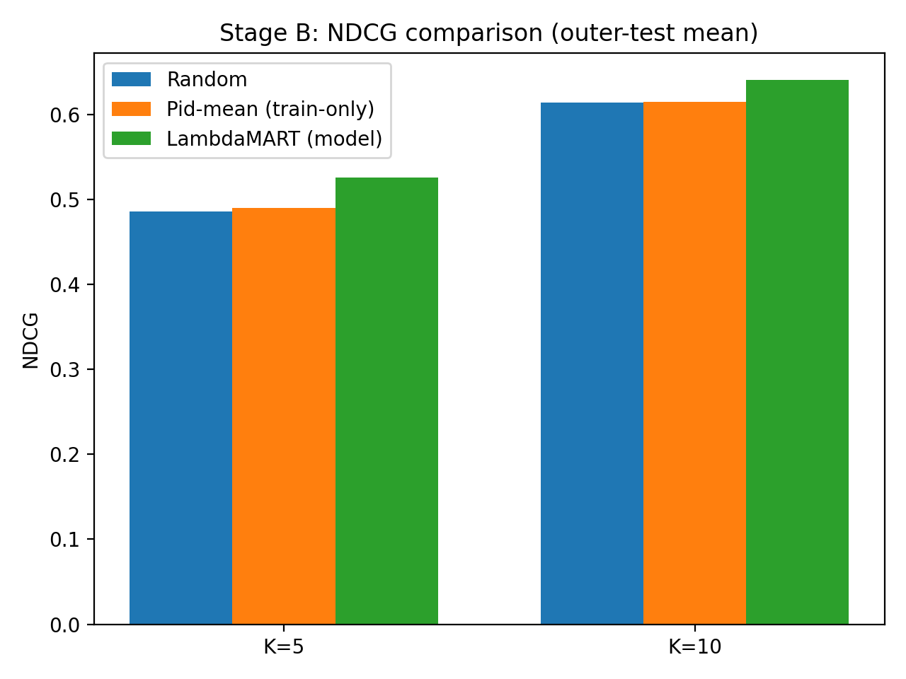
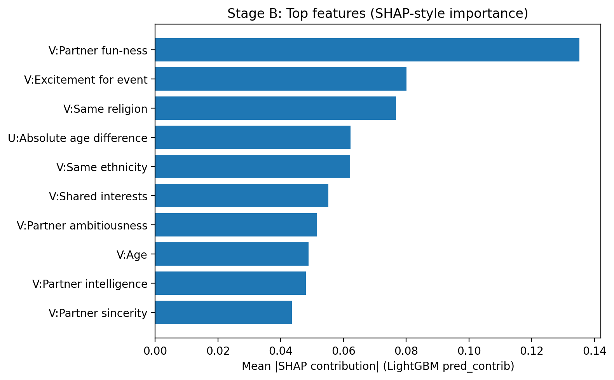

# Predicting Match Quality from Early Interaction Signals

Dating products live or die on **who appears in the top few results**. This repo explores whether *pre-interaction / early signals* can surface better matches in a two-sided market, using the classic Speed Dating dataset.

**Main result:** a LambdaMART (LightGBM) ranker improves **NDCG@5** over strong baselines when ranking *mutual satisfaction* (Stage B).

---

## Dataset

This project uses the **Speed Dating** dataset (experimental events from 2002–2004).  
I used a wave-based split to avoid leakage across events.

Reference datasets:
- OpenML “SpeedDating” dataset page (adapted from the UCI version):  
  ```
  https://www.openml.org/d/40536
  ```
- Kaggle mirror (same underlying data, convenient download):  
  ```
  https://www.kaggle.com/datasets/ulrikthygepedersen/speed-dating
  ```

Data dictionary: see `data/speed_dating_key_extracted.csv` (extracted from the original key file).

---

## Problem framing: reciprocal ranking in a two-sided market

A “query” is one user in one event:
- **Query:** `(wave, iid)` — user `iid` in speed-dating event `wave`
- **Candidates:** all `pid` that `iid` met in that wave
- **Task:** rank candidates so the top of the list contains the best outcomes

### Why ranking (not just classification)?
Classification asks: “Will *this pair* match?”  
Product asks: “Who should appear in the **top 5**?”

So this repo evaluates and trains models using ranking metrics (NDCG / Recall@K), not just AUC.

---

## Stage A (exploratory): predict mutual match (binary)

**Label:** `match` (mutual yes/no)

This was intentionally treated as an *exploratory* stage because the label is noisy and shifts across events (waves). It still provides a baseline and shows the iteration process.

Best Stage A (nested CV, wave-based outer split, core features):
- K=5  NDCG **0.2920 ± 0.0464**
- K=10 NDCG **0.3879 ± 0.0467**

**Takeaway:** “match” was too noisy as a proxy for “good outcomes,” so I pivoted to Stage B.

---

## Stage B (main deliverable): predict mutual date quality (graded)

**Label:** `quality = min(like, like_o)` in \[0, 10\], i.e., mutual enthusiasm.

**Metric:** NDCG@K computed on a binary relevance derived from quality, plus threshold Recall@K for quality ≥ 7 and ≥ 8.

Final Stage B (outer-test mean±std; nested CV selection by inner-val NDCG@5):
- Random baseline:  
  - K=5  NDCG **0.4878 ± 0.0487**  
  - K=10 NDCG **0.6156 ± 0.0534**
- Partner-prior baseline (pid mean quality from TRAIN only):  
  - K=5  NDCG **0.4800 ± 0.0450**  
  - K=10 NDCG **0.6084 ± 0.0524**
- **LightGBM LambdaMART (best):**  
  - K=5  NDCG **0.5296 ± 0.0530**  
  - K=10 NDCG **0.6460 ± 0.0515**  
  - Recall@5 (quality ≥ 7): **0.6924**  
  - Recall@5 (quality ≥ 8): **0.3169**

Frozen config (used for final eval):
```json
{
  "learning_rate": 0.03,
  "num_leaves": 31,
  "min_data_in_leaf": 150,
  "lambda_l2": 20.0,
  "max_depth": 8,
  "feature_fraction": 0.85,
  "bagging_fraction": 0.85,
  "bagging_freq": 1
}
```

---

## What features are in “core features”?

The core feature set is designed to be realistic for “early / pre-interaction” ranking:

**A) User / partner profile signals (u vs v)**
- demographics: age, gender, race, field of study, etc.
- stated intent: goal for attending the event

**B) Stated preferences (“what I say I want”)**
- preference weights on attributes like attractiveness / sincerity / intelligence / fun / ambition / shared interests

**C) Expectations**
- expected number of good matches, expected happiness, etc.

**D) Simple interaction features**
- absolute age difference
- same-race indicator
- preference alignment proxies (dot-products between preference vectors and self-rating vectors)

> Note: Outcome-leaky columns (anything that directly encodes post-date outcomes) are excluded from training features.

---

## Visuals (generated)

After running Script 14, you should have:
-  — baseline vs model NDCG bars
-  — importance plot

---

### Stage B: what the model is using (Top-10)

SHAP-style importances (LightGBM `pred_contrib`, mean absolute contribution):

| rank | Feature (short) | Feature (raw) |
| --- | --- | --- |
| 1 | V:Partner fun-ness | num__fun3_1_v |
| 2 | V:Excitement for event | num__exphappy_v |
| 3 | V:Same religion | num__imprelig_v |
| 4 | U:Absolute age difference | num__abs_age_diff |
| 5 | V:Same ethnicity | num__imprace_v |
| 6 | V:Shared interests | num__shar1_1_v |
| 7 | V:Partner ambitiousness | num__amb3_1_v |
| 8 | V:Age | num__age_v |
| 9 | V:Partner intelligence | num__intel1_1_v |
| 10 | V:Partner sincerity | num__sinc1_1_v |

Key takeaways:
- Candidate beliefs/preferences dominate: the strongest signal is the candidate's *belief that others value fun* (`fun3_1_v`).
- Event-level optimism matters: higher expected happiness with event partners (`exphappy_v`) is a strong predictor of higher mutual satisfaction.
- Stated similarity constraints show up: importance of same religion / ethnicity (`imprelig_v`, `imprace_v`).
- Simple pairwise structure matters: absolute age gap (`abs_age_diff`).
- Classic preference weights contribute: shared interests, ambition, intelligence, sincerity (`shar1_1_v`, `amb3_1_v`, `intel1_1_v`, `sinc1_1_v`).

> Note: these are *model usage* signals for ranking, not causal effects.


## Repo layout

```
data/        # raw data + key
results/     # parquet datasets + metrics csv (gitignored)
reports/     # final summaries, data dictionary extraction
scripts/     # pipeline scripts (numbered)
```

---

## How to run (high-level)

1) Create venv + install deps:
```bash
python -m venv .venv
# activate your venv...
pip install -r requirements.txt
```

2) Build datasets + train + evaluate:
```bash
bash run_final.sh
```

3) Generate figures + top features:
```bash
python scripts/14_make_stage_b_figure.py
```

---

## Notes / next steps

- A deeper ML extension would be a **two-tower retrieval** model, but this dataset’s small size and event heterogeneity makes it a tougher fit than tree ranking.
- If I had better product logs (message text, swipes, time-on-profile, retention), I’d push toward representation learning + counterfactual evaluation.
